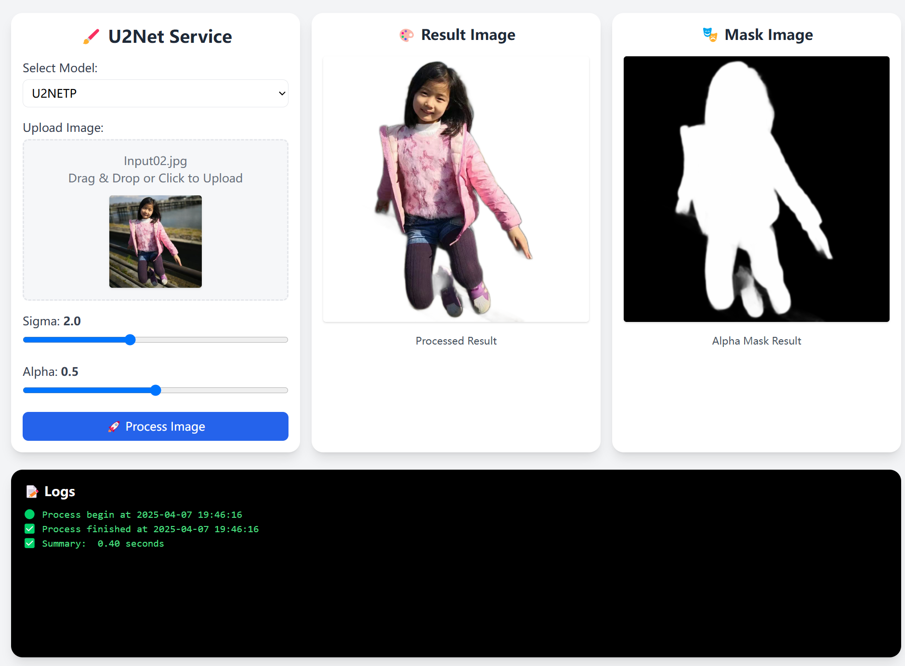

Simple Web demostration for U2Net

Run on python 3.10

#### GetImageMask.py

```
GetImageMask: Image mask generator using U2Net family models.
```

```
options:-h, --help            show this help message and exit
--img_input IMG_INPUT          Input image path
--img_output IMG_OUTPUT        Output image path, png format
--msk_output MSK_OUTPUT        Output mask path, png format
--model MODEL         Model name: u2net / u2netp(default) / u2netportrait
--sigma SIGMA         Gaussian blur sigma, 2(default), used for u2netportrait only
--alpha ALPHA         Alpha blending factor, 0~1, 0.5(default), used for u2netportrait only
```

for U2NETP

[Before loading] CPU Memory: 440.76 MB | GPU Memory: 0.00 MB

🟢 WarmupModel...
✅ WarmupModel completed in 0.31 seconds.
🟢 RunningModel...
✅ RunningModel completed in 0.19 seconds.
[Process Finished] CPU Memory: 891.08 MB | GPU Memory: 564.07 MB

for U2NET

[Before loading] CPU Memory: 441.16 MB | GPU Memory: 0.00 MB
🟢 WarmupModel...
✅ WarmupModel completed in 0.48 seconds.
🟢 RunningModel...
✅ RunningModel completed in 0.21 seconds.
[Process Finished] CPU Memory: 1093.29 MB | GPU Memory: 969.75 MB

use RunServer.bat to start a server [on windows]


